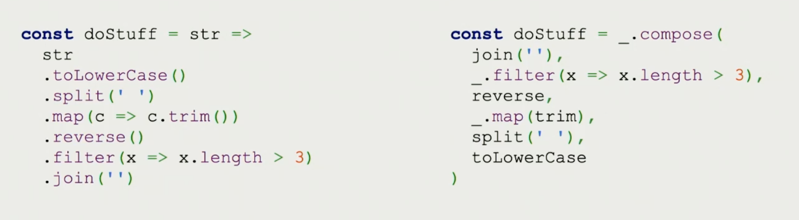

# Composition

Created: April 6, 2022 4:16 PM
tags: functional programming, javascript

Composition is posible in JS through a pipeline

```jsx
const compose = (f, g) => x => f(g(x));
```

Just means nesting the function call 

```jsx
const add = (x, y) => x + y;

const toUpper = str => str.toUpperCase();
const exclaim = str => str + '!';
const first = xs => xs[0];

const compose = (f, g) => x => f(g(x));

const shout = compose(exclaim, toUpper);
console.log(shout('tears');
```

Translating the last function call means the compose function would be called as:

```jsx
const compose = x => exclaim(toUpper(x));
```

⚠️ This would mean that a compose call would be read right to left (ie. first the toUpper would be applied to x and then exclaim) ⚠️

<aside>
💡 Compose is also available in rambda lib

</aside>

Then you can also sub compose the calls, forming a pipeline for the data to flow through:

```jsx
const loudFirst = compose(toUpper, first);
const shout = compose(exclaim, toUpper);
```

<aside>
💡 Composition is equivalent to dot chaining

</aside>



## Logging in composition

Logging in composition can be achieved chaning a function

```jsx
const log = curry((tag, x) => (console.log(tag, x), x));
...
const shout = compose(exclaim, log('here'));
```

Introduces side effects but its effective for debuging