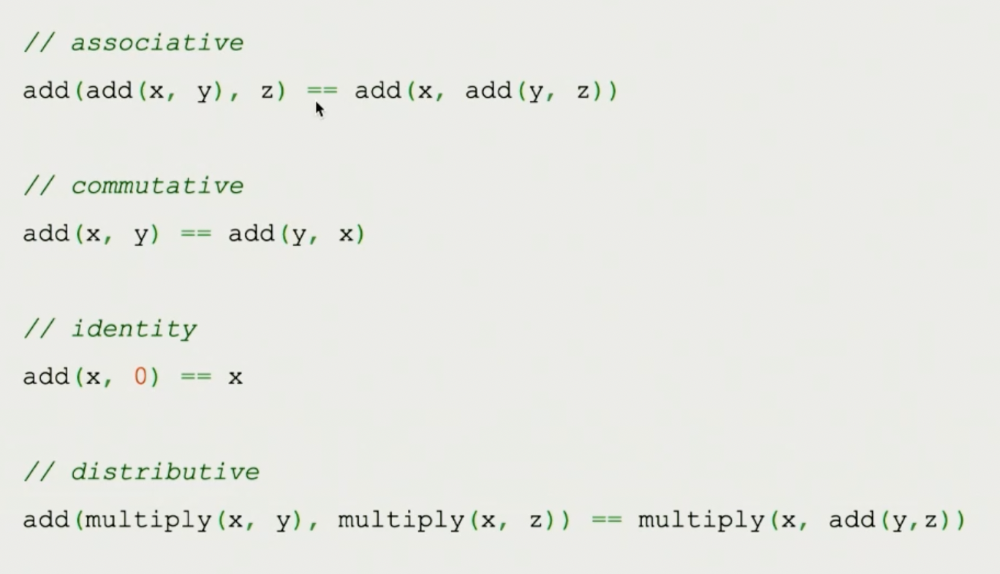

# Currying

Created: April 6, 2022 4:13 PM
tags: curry, functional programming, javascript

# Properties

## Associative

Doesn’t matter how the function is parenthezised, always return the same result

## Commutative

You can switch the arguments around, the order in which they’re passed doesnt affect the reult

## Identity

Gives a value back

## Distributive

You can distribute the function nesting

### Example



# Arguments

```jsx
const add = (x, y) => x + y;
```

In JS, calling a function with multiple arguments is the same as calling it with just one.

```jsx
const add = (x, y) => x + y;

const toPair = f =>
  ([x, y]) => f(x, y);

const fromPair = f => 
	(x, y) => f([x, y]);

const result = toPair(add)([1, 2]);
const result = fromPair(toPair(add))(1, 2);
```

# Currying

Curry is a function that takes a function and takes one argument at a time.

```jsx
const add = (x, y) => x + y;

const curry = f => 
  x => y => f(x, y);

const curriedAdd = curry(add);
const increment = curriedAdd(1);
const result = increment(4);
```

> This means we can take any function that takes several arguments and turn it into one that only takes one (curry a function)
> 

```jsx
const curry = f => 
  x => y => f(x, y);

const modulo = curry((x, y) => y % x);
const isOdd = modulo(2);
const result = isOdd(3);
```

Modulo is a curried function. isOdd preloads the modulo function with its first parameter and returns a function waiting for its second argument.

> I choose curry when i want to remember an argument and pass it around
> 

```jsx
const curry = f => 
  x => y => f(x, y);

const filter = curry((f, xs) => xs.filter(f));
const getOdds = filter(isOdd);
const result = getOdds([1, 2, 3, 4, 5]);
```

Always pass the operation function first and the data on which it should operate last.

## Using rambda generalization

Rambda is a library that includes several utilities for functional programming, including curry.

The curry generalization allows to pass any number of arguments to a function instead of just 2

```jsx
const replace = curry((regex, replacement, str) =>
  str.replace(regex, replacement)
);

const replaceVowels = replace(/[AEIOU]/gi, "!");
const result = replaceVowels("Hey I have words");
```